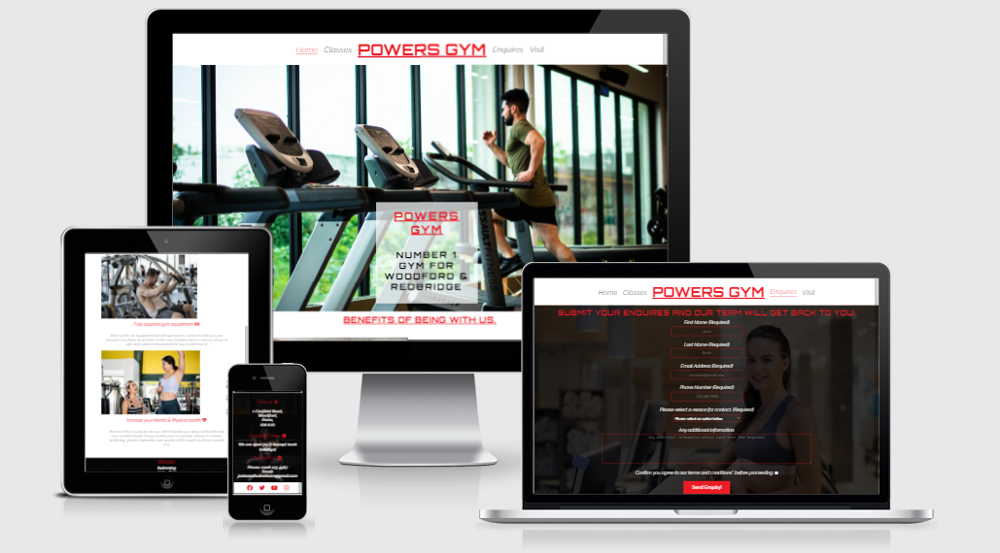
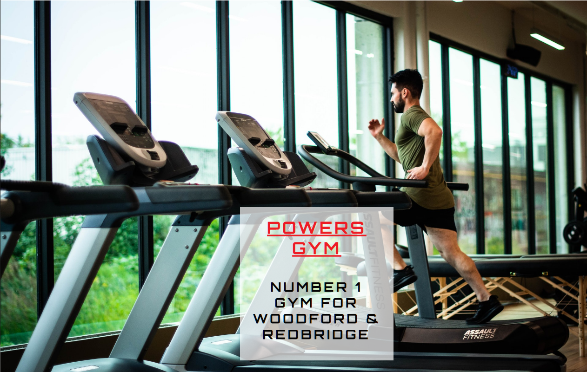
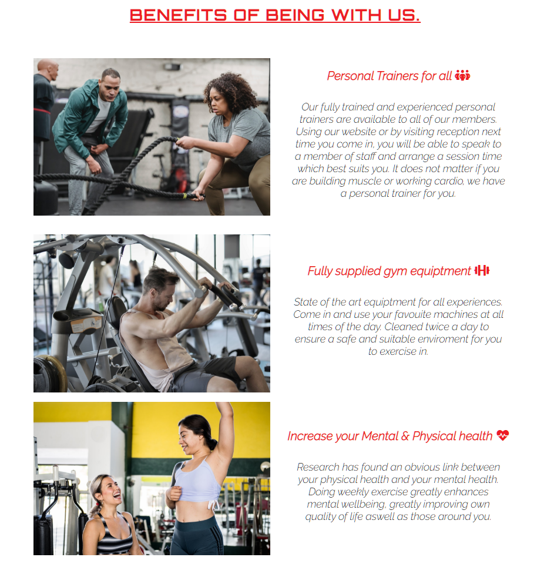
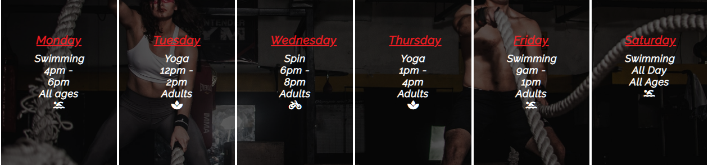
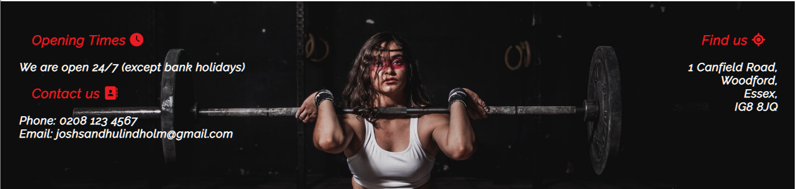
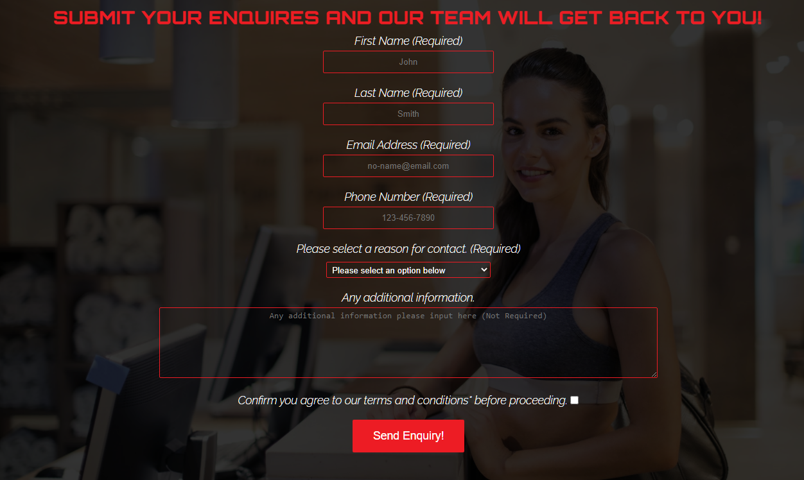
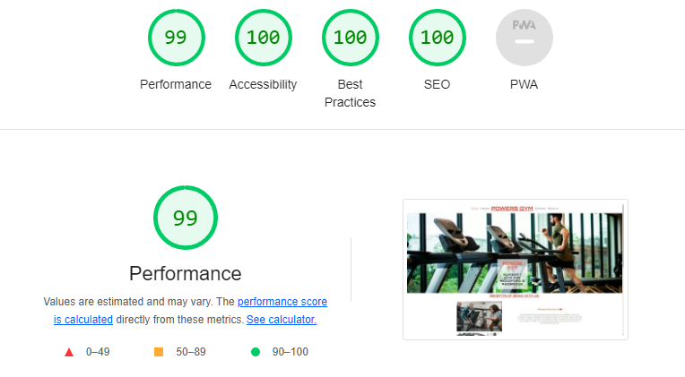

# Powers Gym.

## Overview.

The Powers Gym website is a place where people can find out information they require about their local gym. The simple yet powerful layout and colors aim to attract a specific type of users. With information relating to the ideal target audience. The main purpose is to attract new members to join as well as allow current members to find out information via form or information already presented.

## Features

On this website the aim is to try and project consistency from page to page and follow a simple yet effective color contrast which matches all over the site. 

### Existing features

- **Navigation and header bar**

    * Featured on both pages, this fully responsive navigation bar shows the logo and quick select options for main sections: Classes and Enquiries.
    * Working on both pages, it allows a user to navigate backwards to the home page or specific section without using browser controls.

- **Landing page large image**
    
    * The initial landing page shows a large image including a text overlay to allow users to show the basic uses and area of purpose for this site.
    * The text has a small animation which helps attract a user's eyes without becoming hard to read or distracting.

- **Benefits section**

    * Within the benefits section a user will be able to read the information with matching pictures in a pleasing and easy flow way.
    * Responsive to show the text under the pictures on smaller devices so flow is never affected.

- **Classes section**

    * This section is aimed at separating attractive classes in a way which is easy for users to understand.
    * With responsive features restructuring in a way that continues to be readable even on mobile devices.

- **About us section**

    * Ensuring information about location and contact details is important to many businesses with this section clearly stating both.
    * The responsive features allow for the information to be stated clearly on all devices.

- **Footer**

    * The footer section is key in ending the webpage with key information, linking a user to key social media links.
    * This is valuable to a user to help connect them with the business.

- **Enquiries page**

    * With the aim of attracting new and retaining old, a enquires form allows all users to get in contact with the business.
    * Easy layout which is responsive and allows for the company to gather as much information as possible.

## Features Left to Implement.

- Another idea would be to add a gallery page with images to attract new members and show off current.

- A embedded map above the about us section would also be a great idea to showcase the business location.

## Testing

#### All testing completed on the site was using a multiple of devices, browsers and operating systems. Windows, IOS and Android. While also using Developers tools to ensure a responsive design.

- **Header and nav**

    * Initial issues found was the layout of the nav bar when working on smaller screens. The fix for this was to allow FlexBox with ordering and manage the flow better with media queries.
    * Once the bug was fixed the header was consistent on all devices and with a responsive display.

- **Landing page large image and text box**

    * At the start of testing I found an issue with the text box and how it positions itself on the page. I found the issue was by making the text box display: absolute. I fixed this issue by changing this to relative and allowing a more consistent flow.

- **Benefits section**

    * Testing for this section was very good. initial tests showed everything worked as planned even on smaller devices. Allowing a media query to turn from 2 columns into 1 when screen size required it.

- **Classes section**

    * After the initial issue of calculating the right ratio of the sections there were no further issues.

- **About us**

    * While testing on smaller screens the immediate issue was the positioning of the text. While centering the next issue was the clashing of background and text colors. The fix for this was to add a background color to the text that is somewhat transparent to allow the text to be read. This only works on smaller screens as not necessary on larger ones.

- **Footer**

    * While testing the footer it came to my attention that on the form page it was not showing up. The fix for this was a missing end tag on my footer. Otherwise no issues found.

- **Form**

    * Initial testing with the form showed a white background on the dropdown box. This was fixed with a targeted background color change. Using this opportunity we also ensured the form had a consistent flow.

## Validator Testing

- HTML
    * No errors were returned when passing through the official [W3C validator](https://validator.w3.org/nu/?doc=https%3A%2F%2Fjoshsandhu.github.io%2FProject_1%2F)

- CSS 
    * No errors were returned when passing through the official [(Jigssaw) validator](https://jigsaw.w3.org/css-validator/validator)

- Accessibility
    * I confirmed with Lighthouse in devtools that the website is easy to read and accessible.

## Deployment

The live link for this website can be found [here](https://joshsandhu.github.io/Project_1/)

- The site was deployed to GitHub pages. The steps are as follows:
    * In GitHub repository, navigate to the Settings tab.
    * From there go down to Pages in the left column.
    * On the source selection drop-down box select the Master Branch.
    * Once this has been selected you are given a link after a page refresh.

## Credits

I would like to take this space to say thank you to all the artists for their photos which I have used within the webpage. I would also like to thank you to the specific programmers who I have used code and ideas from within the webpage.

### Content

- The footer was code from the 'Love Running project' by Code Institute 
- The base code for the classes section was also taken from the 'Love Running project' by Code Institute 

### Media

- All photos used within the project was sourced from https://pexels.com/ 
    * Man on treadmill photo by William Choquette from Pexels
    * Personal trainer Photo by Julia Larson from Pexels
    * Gym equipment Photo by Andrea Piacquadio from Pexels
    * Laughing gym goers Photo by Victoria Coman from Pexels
    * Two girls laughing Photo by Los Muertos Crew from Pexels
    * Solo deadlift Photo by Leon Ardho from Pexels
    * Gym reception Photo on form page by Andrea Piacquadio from Pexels

